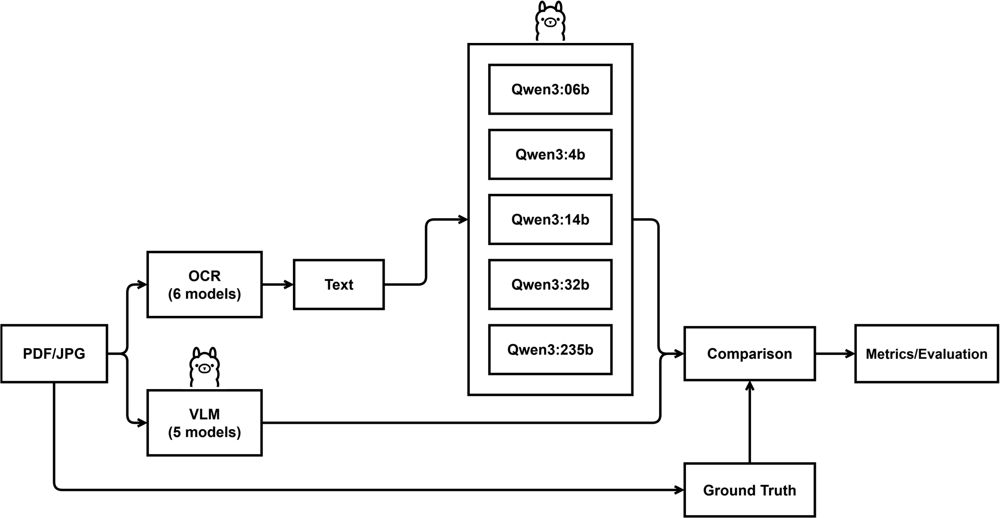
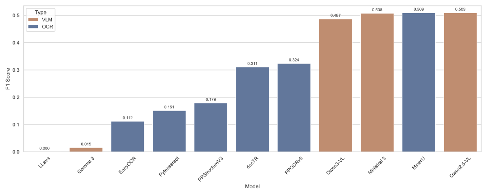
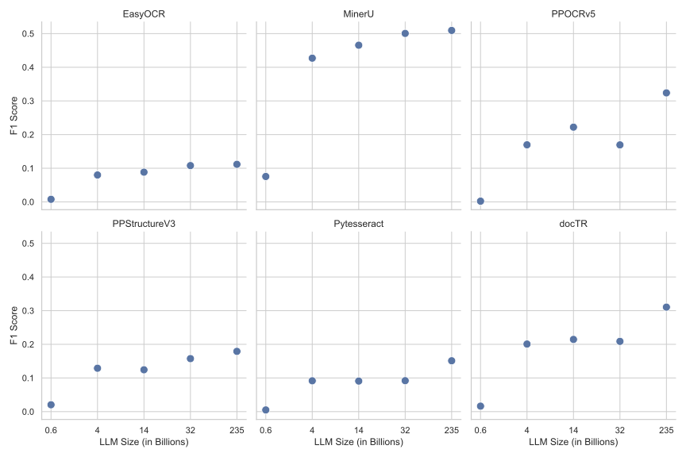
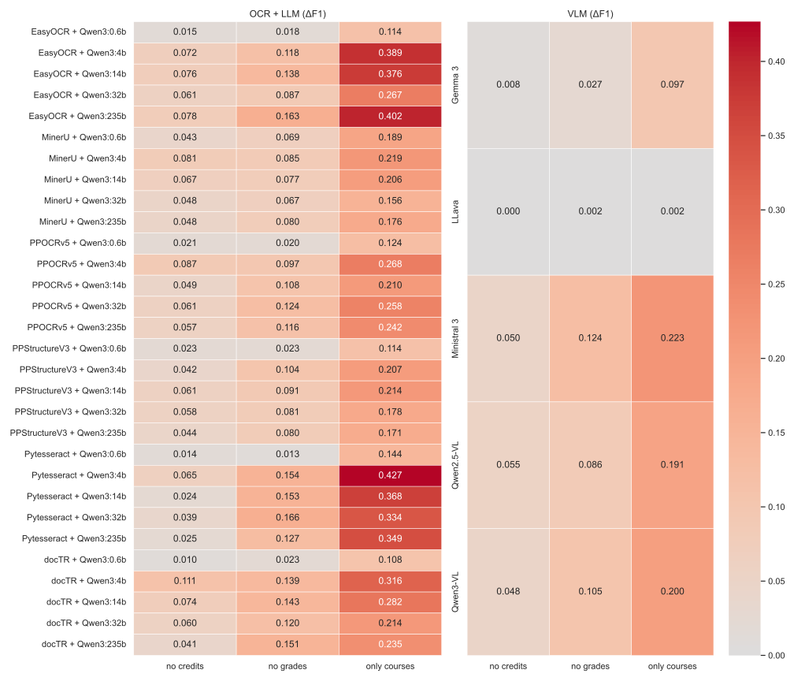

# OpExStructBench: Benchmarking Open Extraction of Structured Information in a High Risk Public Sector Application

A benchmark repository evaluating open-source, off-the-shelf machine learning methods
for extracting structured information from unstructured documents in a realistic,
high-risk public sector setting. This repository serves as a companion to
[BHT_PDF](https://github.com/calgo-lab/BHT_PDF), which contains practical
implementations based on the research developed here.

## Abstract

The extraction of structured information from unstructured documents represents a 
critical component of digital transformations in all sectors. While proprietary 
solutions dominate commercial applications, a rapidly growing ecosystem of open-source 
Optical Character Recognition (OCR) engines, Large Language Models (LLMs), and 
Vision-Language Models (VLMs) offers accessible alternatives. However, systematic 
evaluations on realistic, multi-step extraction pipelines remain scarce. Responsible 
usage of such extraction tools requires comprehensive evaluations on realistic tasks, 
especially as these solutions will be key components of applications in the public 
sector that the EU AI Act categorizes as high risk. To address this gap, we present a 
comprehensive benchmark assessing the end-to-end performance of open-source systems on 
a complex real-world document processing task classified as high risk: student 
applications for an international study programme. Our results reveal that while VLMs 
generally outperform OCR+LLM pipelines, even state-of-the-art open-source models 
struggle to handle such tasks reliably in zero-shot settings. Only 4 of 35 
configurations achieved F1 scores above 0.5, and roughly 75% of all configurations 
scored below 0.25. Model scale influences performance, yet the relationship is 
non-linear: substantially larger models do not guarantee proportionally better results. 
Input quality, particularly the structural preservation of OCR output, emerges as a 
critical factor independent of downstream model capability.

## Task & Dataset

The benchmark evaluates a three-step extraction pipeline on 100 real-world academic
transcripts submitted as part of student applications to a Data Science Master's
programme. Documents are heterogeneous in language (English, German, Turkish, Russian)
and structure, typically containing a mix of tables, free text, and institutional
imagery. Each model is tasked with:

1. Digitalizing the document (OCR step or direct image input for VLMs)
2. Extracting all Computer Science and Mathematics courses deemed relevant
3. Returning results as a structured output conforming to a fixed Pydantic schema with
   four fields: `academic_field`, `course_name`, `grade`, and `awarded_credits`

The ground truth comprises 952 rows across all 100 documents, ranging from 0 to 44
rows per document. Due to privacy constraints, the dataset is not published in its
current form.

## Models

### OCR + LLM Pipeline
All OCR engines were used with pretrained weights and paired with
[Qwen3](https://ollama.com/library/qwen3) at five parameter sizes via
[Ollama](https://ollama.com/), which enforces structured output through its integrated
format API.

| Model         | Repository                                                           |
|---------------|----------------------------------------------------------------------|
| docTR         | [mindee/doctr](https://github.com/mindee/doctr)                      |
| EasyOCR       | [JaidedAI/EasyOCR](https://github.com/JaidedAI/EasyOCR)              |
| MinerU        | [opendatalab/MinerU](https://github.com/opendatalab/MinerU)          |
| PPOCRv5       | [PaddlePaddle/PaddleOCR](https://github.com/PaddlePaddle/PaddleOCR)  |
| PPStructureV3 | [PaddlePaddle/PaddleOCR](https://github.com/PaddlePaddle/PaddleOCR)  |
| Pytesseract   | [madmaze/pytesseract](https://github.com/madmaze/pytesseract)        |

| Qwen3 Variant | Parameters | Context Length |
|---------------|------------|----------------|
| Qwen3         | 0.6B       | 40K            |
| Qwen3         | 4B         | 256K           |
| Qwen3         | 14B        | 40K            |
| Qwen3         | 32B        | 40K            |
| Qwen3         | 235B       | 256K           |

### VLM Pipeline
All VLMs were run via [Ollama](https://ollama.com/) using the same Pydantic schema and
format API as the OCR+LLM pipeline.

| Model          | Parameters | Ollama                                                        |
|----------------|------------|---------------------------------------------------------------|
| Gemma3         | 27B        | [ollama/gemma3](https://ollama.com/library/gemma3)            |
| LLaVA          | 7B         | [ollama/llava](https://ollama.com/library/llava)              |
| Ministral 3    | 14B        | [ollama/ministral-3](https://ollama.com/library/ministral-3)  |
| Qwen2.5-VL     | 32B        | [ollama/qwen2.5vl](https://ollama.com/library/qwen2.5vl)      |
| Qwen3-VL       | 32B        | [ollama/qwen3-vl](https://ollama.com/library/qwen3-vl)        |

## Methodology

Each model processes 100 document inputs (PDF for OCR-based models, JPG for
image-based models and VLMs) and returns structured extraction results conforming to
the fixed Pydantic schema. Prompts and schema definitions can be found
[here for the OCR+LLM pipeline](./src/OCR/llm_ollama.py) and
[here for the VLM pipeline](./src/VLM/vlm_ollama.py).

Model outputs and ground truth are each tokenized row-wise, converting each extracted
record into a single token representing the full row. Precision, Recall, and F1 are
then computed using a Jaccard-similarity-based comparison of the resulting token sets.
Non-compliant outputs (e.g. due to generation failures or schema violations) are
treated as complete extraction failures.

## Results

Overall performance is low across all configurations: only 4 of 35 configurations
exceed an F1 of 0.5, and roughly 75% score below 0.25. VLMs produce polarized results,
with Qwen2.5-VL (F1: 0.509) and Ministral-3 (F1: 0.508) achieving the highest scores
overall, while LLaVA (F1: 0.000) and Gemma3 (F1: 0.015) fail almost entirely. Within
the OCR+LLM pipeline, MinerU paired with Qwen3:235B matches the best VLM performance
(F1: 0.509), largely due to MinerU's ability to preserve the spatial and tabular
structure of the source document. All other OCR engines perform substantially worse,
highlighting that input quality is at least as consequential as downstream model
capability. In all OCR+LLM combinations, Qwen3:235B achieved the best F1 score.

Larger LLMs generally perform better, but not proportionally so. The 0.6B model
consistently fails across all OCR engines, frequently entering a repetitive generation
loop that produces outputs not conforming to the required schema. Beyond this outlier,
gains from increasing model size are modest and non-linear: for PPOCRv5 and docTR, the
14B model even outperforms the 32B variant.

Removing grade or credit columns from evaluation and measuring the resulting F1
improvement (ΔF1) reveals that grade extraction is consistently the harder of the two
sub-tasks. Results improve more when grades are excluded than when credits are excluded,
likely due to the diversity of grading formats across transcripts (letter grades,
numerical scales) which introduces ambiguity even when explicit handling rules are
provided in the prompt. The largest improvements are seen when both columns are removed,
as only course name and academic field need to match. These patterns hold consistently
across both VLM and OCR+LLM configurations.

## Conclusion

None of the tested approaches can be considered a reliable out-of-the-box solution for
complex extraction tasks of this kind, with roughly 75% of all configurations scoring
below an F1 of 0.25. Input quality is at least as important as model capability:
OCR engines preserving document structure yield dramatically better downstream results.
VLMs generally outperform OCR+LLM pipelines but are far from reliable, and neither a
newer nor a larger model guarantees better performance. Improved preprocessing, prompting
strategies, and schema definitions are promising directions for improvement, but require
additional effort beyond simply selecting a capable model off the shelf.